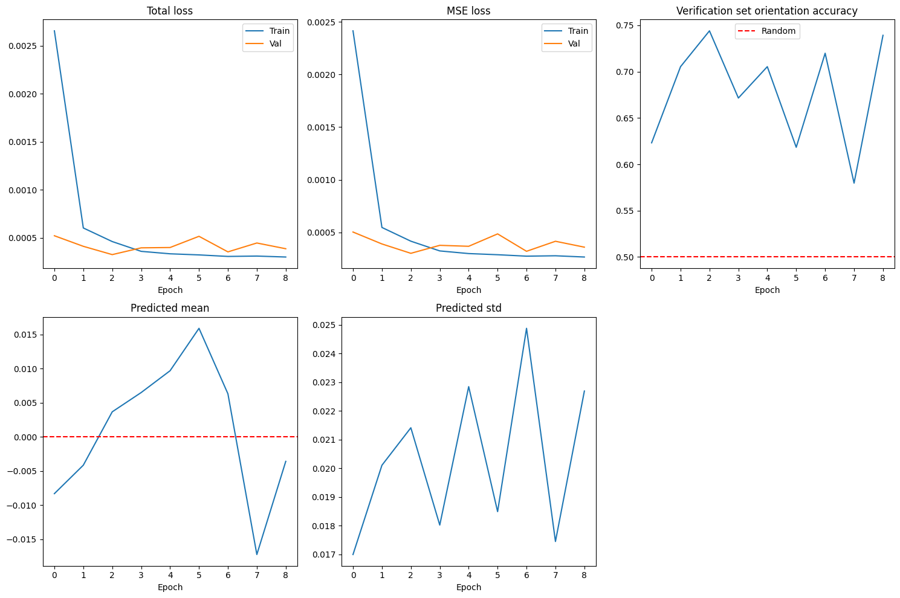

# 沪深300走势预测技术报告
作者：孟子涵
## 第一章  引言
中国 A 股市场以散户占比高、波动剧烈而著称，短期价格运行既受宏观基本面、资金成本的影响，也取决于技术交易和情绪驱动。本报告尝试在统一的日频序列内，整合宏观、行业与交易三条结构化信息流，并引入非结构化的情绪因子，通过双层 GRU 网络预测沪深 300 未来五日复合收益。研究首先构建涵盖 2015–2025 十年全数据周期的特征面板，通过差分、利差、动量等方法派生关键驱动因子；随后制定滑动窗口训练—验证—测试流程，对模型稳健性进行完整检验。结果显示，仅依赖结构化特征即可获得77 %以上的方向准确率和0.69以上的预测—真实序列相关性。然而，模型也体现出对单日极端波动反应滞后的缺陷，说明下一步工作重点应是系统化引入非结构化的情绪因子。[^1]
[^1]: 受限于TuShare API访问限制，本阶段的研究并未成功抓取新闻标题，因此这是下阶段工作重点。

## 第二章  指标和数据说明
### 2.1  结构化数据
本研究将沪深 300 作为预测对象，样本区间设定为 2015 年 1 月 5 日至 2025 年 5 月 22 日，包含牛市和震荡市，同时兼顾了主要宏观指标的可得性。所有指标按照宏观—中观—微观三条逻辑主线组织，以覆盖自上而下各层级的驱动因子。

宏观层面首先关心整体经济增长与财富创造速度，因为盈利扩张与流动性宽裕是股市繁荣的根本。选取CPI 当月同比和 PPI 当月同比，分别刻画终端需求端与生产端的价格压力；M2 同比反映广义货币供给的松紧，在中国具有“政策温度计”属性；制造业 PMI 直接给出制造业扩张/收缩的荣枯信号，能够领先于工业企业利润和就业变化。考虑到资金面对估值的立即影响，宏观层还并入了 7 天质押式回购加权利率、中国与美国 10 年期国债收益率、美元指数以及标普 500 指数，前两者衡量本土无风险利率水平及期限溢价，后两者代表全球风险偏好和外部流动性方向，它们共同决定了跨市场资金的边际配置倾向。

中观层面指行业基本面。沪深 300 行业权重集中于金融、周期和部分大消费板块，指数的短中期波动往往受大宗商品价格和开工景气牵引。为此，加入钢材综合价格指数、WTI 原油期货结算价以及 247 家高炉开工率。钢价和原油价分别代表黑色工业链与能源链的定价中枢，而高炉开工率是对钢铁产能利用的实时量度，其变化常提前体现实体需求冷暖和库存周期的轮动。

微观层面抓取交易维度的信息，以补足宏观、中观信号在高频噪声中的盲区。沪深 300 指数点位、换手率和市盈率描述价格水平、博弈强度与估值极端程度；融资融券余额用于量化杠杆资金情绪，在散户占比高、情绪化特征突出的 A 股，中短期行情对两融余额的变化尤为敏感。所有原始数据的频率、计量单位与来源列示于表 2.1。

表2.1  结构化数据原始数据概述  
| 原始数据 | 频率 | 单位 | 数据来源 |
| ------ | ---- | --- | ------|
| **宏观数据** |
| CPI（当月同比） | 月 | % | 国家统计局 |
| PPI（当月同比） | 月 | % | 国家统计局 |
| M2（同比） | 月 | % | 中国人民银行 |
| 制造业PMI | 月 | % | 国家统计局 |
| 固定资产投资累计完成额 | 月 | 亿元 | 国家统计局 |
| 基础设施建设累计完成额 | 月 | 亿元 | 国家统计局 |
| 房地产开发投资累计完成额 | 月 | 亿元 | 国家统计局 |
| **宏观（资金面）数据** |
| 银行间质押式回购加权利率（7天） | 日	| % | 中国货币网 |
| 中国10年期国债收益率 | 日 | % | 中国货币网 |
| 美国10年期国债收益率 | 日 | % | 美国财政部 |
| 标准普尔500指数 | 日 | 点 | 标准普尔 |
| 美元指数 | 日 | 1973年3月=100 | CEIC |
| **中观（行业）数据** |
| 中国247家高炉开工率 | 周 | % | Wind |
| 中国钢材综合价格指数 | 周 | 1994年4月=100 | Wind |
| WTI原油期货结算价 | 日 | 美元/桶 | Wind |
| 商业银行不良贷款比例 | 季 | % | 国家金融监督管理总局 |
| 证券公司营业收入 | 季 | 亿元 | 中国证券业协会 |
| 白酒批发价格总指数 | 日 | 2012年2月=100 | Wind |
| 半导体中信行业指数 | 日 | 点 | 中信证券 |
| **微观（交易）数据** |
| 沪深300指数 | 日 | 点 | 上海证券交易所 |
| 沪深300指数换手率 | 日 | % | Wind |
| 沪深300指数市盈率 | 日 | 倍 | 中证指数公司 |
| 融资融券余额 | 日 | 亿元 | 中国证券金融公司 |

### 2.2  非结构化数据
结构化指标能够解释经济、行业与交易层面的驱动力，但它们无法实时捕捉市场情绪和叙事的冲击。A股有两亿多散户、一亿多活跃散户，他们对新闻标题、社交话题、政策表态等非量化信息异常敏感，在同一宏观和行业背景下，不同舆情氛围往往导致不同的价格路径。本质上说，A股的收益特点是有偏的、负收益预期的波动，即表现为强烈的情绪化特征。因此，本研究额外引入了文本型非结构化数据，以捕捉散户的情绪。非结构化部分的角色是补足结构化特征遗漏的舆情面向，让模型有机会分辨“基本面一致、情绪却截然不同”的场景。

本次数据来源选择了 TuShare Pro 的财经新闻接口，以收集金融主题的新闻。该接口自 2008 年起每日归档主流媒体（如券商中国、上证报、21 世纪经济报道等）发布的标题与简短摘要，调用只需按日期批量拉取，无需自行编写网页爬虫，非常适合在初步模型中使用。具体而言，统一下载了 2015-01-05 至 2025-05-22 区间内的全部标题文本，并将其与交易日历对齐，形成一张“每日新闻集合”，为后续情绪建模留出入口。

受时间限制，本报告未涉及其他非结构化数据源。当后续研究继续推进时，将沿以下三条方向展开：

第一，中国政府网、证监会网站的政策和公告正文。

第二，宏观经济主题的新闻。根据 Audrino & Offner（2024）的研究，从有关利率、通货膨胀和劳动力市场的宏观经济新闻中提取的情绪，对美国短期国债收益率走势有显著影响。

第三，股吧帖子、搜索热度等多模态文本。

### 2.3  数据预处理流程
第一步，划分训练集、验证集和测试集。训练集为2015年1月4日至2023年12月31日的全部数据；验证集为2024年1月4日至2024年12月31日的全部数据；测试集为2025年1月1日至2025年5月23日的全部数据。

第二步，数据下载后首先按照交易日历对齐，以最新发布值向前填充到下一次公布日，并同步记录 staleness（“陈旧度”，即距离上次发布日的天数）。其后再进行对数差分、同比差分、滚动均值与标准化处理，为后续 GRU 网络提供标度统一、数值稳定的输入张量。具体处理方法见表2.2。

表2.2  结构化数据预处理概述
| 原始数据 | 处理方法 | 处理后指标 |
| ------ | ------ | -------- |
| **宏观数据** |
| 固定资产投资累计完成额 | 月度差分 + 同比计算 | 固定资产投资月度增量及同比 |
| 基础设施建设累计完成额 | 月度差分 + 同比计算 | 基建投资月度增量及同比 |
| 房地产开发投资累计完成额 | 月度差分 + 同比计算 | 房地产投资月度增量及同比 |
| 标准普尔500指数 | 日收益率 + 5日累计 | 标准普尔日收益率、5日累计收益 |
| 美元指数 | 日收益率 + 5日累计 | 美元指数日收益率、5日累计收益 |
| **中观（行业）数据** |
| 高炉开工率 | 一阶差分 | 高炉开工率环比变化 |
| 中国钢材综合价格指数 | 20日对数差分 | 钢材价格20日对数收益率 |
| WTI原油期货结算价 | 20日对数差分 | 原油20日对数收益率 |
| 铜价 | 20日对数差分 | 铜价20日对数收益率 |
| 半导体指数 | 20日对数差分 | 半导体指数20日对数收益率 |
| 证券公司营业收入 | 252日对数差分 | 券商营收同比增速 |
| **微观（交易）数据** |
| 沪深300指数 | 日收益率计算 | 沪深300日收益率 |
| 沪深300日收益率 | 20日滚动标准差×√252 | 沪深300的20日年化波动率 |
| 沪深300日收益率 | 60日滚动偏度/峰度 | 收益率60日偏度/峰度 |
| 融资融券余额 | 日变化率计算 | 融资融券余额变化率 |
| **标准化处理** |
| 所有非比率类指标 | 以训练集为基准的 Z-score 标准化 | 标准化后的特征值 |

## 第三章  特征工程
### 3.1  结构化数据派生特征
原始指标本身只给出水平或同比变化，无法直接提供有关价格变化的更多信号。为进一步降低信噪比，我们在数据清洗之后，为宏观、中观、微观每条主线进一步提炼了若干派生特征。下面详细说明派生逻辑与计算方法，如表3.1所示。

表3.1  结构化数据派生特征
| 派生特征 | 计算方法 | 理由 |
| ------ | ------ | ---- |
| **宏观特征** |
| PPI-CPI 剪刀差 | PPI 当月同比 -  CPI 当月同比 | 剪刀差扩大意味着上游成本上升但难以向下游传导，企业盈利承压，对股市形成负面影响 |
| 中债10年-7天回购利差 | 中国10年期国债收益率  - 7天回购利率 | 利差扩大表明流动性宽松且经济预期向好，有利于风险资产估值提升 |
| 美中 10 年期国债利差 | 美国10年期国债收益率 - 中国10年期国债收益率 | 影响跨境资本流动方向。利差收窄或倒挂可能引发资本外流压力，对A股市场形成负面冲击 |
| VIX相对强度 | VIX / VIX的5日移动平均 | 当VIX高于其近期均值时，表明恐慌情绪升温，避险需求增加 |
| PMI动量 | (制造业PMI - 50) / 10 | 将PMI标准化为以0为中心的指标，正值表示经济扩张动能，负值表示收缩压力，影响企业盈利预期 |
| **中观（行业）特征** |
| 原始数据经预处理后已满足需求，因此无额外派生特征 |
| **微观（交易）特征** |
| RSI(14) | 100 - 100/(1 + 14日平均涨幅/14日平均跌幅) | 识别超买超卖状态，RSI>70表明可能超买，<30表明可能超卖，有助于判断短期反转时机 |
| MACD | 12日EMA - 26日EMA |
| MACD信号线 | MACD的9日EMA |
| MACD柱状图 | MACD - MACD信号线 | MACD上穿信号线形成金叉预示上涨动能增强，反之则预示下跌风险 |
| 布林带相对位置 | (当前价格 - 下轨) / (上轨 - 下轨) | 价格在波动区间中的位置。接近上轨 (>0.8) 可能面临压力，接近下轨 (<0.2) 可能获得支撑 |
| 换手率相对强度 | 当日换手率 / 10日平均换手率 | 换手率激增往往伴随转折点 |
| 市盈率/市净率比值 | PE / PB | 比值上升反映市场更看重成长性而非资产价值 |
| 市盈率历史百分位 | 当前PE在过去252日的排序百分位 | 估值的历史相对位置 |
| Parkinson波幅 | 20日内日内最高价/最低价对数比值的标准差 | 相比收盘波动，对日内极端值更敏感 |

### 3.2  非结构化数据派生特征
为了把新闻舆情纳入同一预测框架，基于 TuShare 财经新闻接口下载了 2015-2025 期间全部中文新闻标题，并使用开源中文金融情感模型（Erlangshen-RoBERTa-330M-Sentiment），对每条标题进行句级情绪打分。具体而言，该模型将一句话映射为“正面、负面、中性”的三分类概率分布，在得到此分布后，按照“正面＋1、负面−1、 中性 0”的规则将分类概率加权求和得到一条连续得分。得到逐条打分后，将同一天内的所有新闻情绪取均值得到日度情绪指数，同时记录当日新闻条数作为权重，用来反映信息轰炸的密集程度。日度情绪指数本身落入 [−1,1] 区间，值越高代表整体新闻基调偏乐观，值越低则倾向悲观或风险事件。

进一步，计算两条派生序列，其一是三日滑动均值，用来捕捉情绪惯性；其二是 60 日滚动 ，把当日情绪置于近三个月分布中衡量“极端程度”，绝对值大于 2 时常对应政策或黑天鹅事件的舆情极端。

所有情绪特征均按交易日与结构化面板左连接。遇到停牌日或无新闻日，所有指标记为0，并同步生成 news_sent_stale 计数，用于提醒模型“情绪信号距上次更新已隔天数”。

## 第四章  模型与训练
### 4.1  输入—输出定义
预测任务被表述为一个监督式序列回归问题：模型在每个交易日 t 接收先前 30 个交易日的特征矩阵 $X_{t-29:t}\in R^{30\times(S+U)}$，其中S为结构化因子维数，U为情绪因子维数，最终模型输入特征中，S = 18，U = 4，如表4.1所示；网络输出单一标量 $\hat{y}_t$，对应未来五个交易日（t至t+4）日收益的复合值（即复利）。之所以要预测五日复利，是因为单日收益率的信噪比过大，模型输出容易倾向于0。

表4.1  模型输入特征
| 类别 | 名称 |
| --- | --- |
| 宏观特征 | CPI（当月同比）、PPI-CPI剪刀差、M2（同比）、PMI动量 |
| 宏观（资金面）特征 | 银行间质押式回购加权利率（7天）、中债10年-7天回购利差、VIX相对强度、美元指数5日累计收益 |
| 中观（行业）特征 | 钢材价格20日对数收益率、原油20日对数收益率、高炉开工率环比变化 |
| 微观（交易）特征 | 沪深300的20日年化波动率、MACD柱状图、布林带相对位置、RSI(14)、换手率相对强度、融资融券余额变化率、市盈率历史百分位 |
| 非结构化特征 | 日度情绪指数、三日滑动均值、60日滚动 Z-score、当日新闻条数 |

### 4.2  网络结构
核心模型由两层GRU（Gated Recurrent Unit，门控循环单元）组成，设置为每层 64 个隐单元，并在第二层后施加 20% 随机 dropout 以减轻过拟合。GRU 的优势在于结构简单，便于初始模型的调整。网络读取完整序列后仅取末端时间步的隐藏向量，经单层全连接映射至实数空间输出。形式上，

$$ h_t = GRU(X_{t-29:t}) $$
$$ \hat{y}_t = Wh_t + b $$

其中，$h_t\in R^{64}$。输出端不加激活函数。损失函数采用 Huber 误差（微调阶段可以加Sharpe-loss，但训练初期特别“抖”，因此采用Huber），并附加 0.05 倍预测值二范数作为正则。形式化为：

$$ L = Huber(\hat{y},y) + 0.05 ||\hat{y}||^2_2 $$

### 4.3  训练流程
数据在时间轴上按训练（2015年1月4日至2023年12月31日）—验证（2024年1月4日至2024年12月31日）—测试（2025年1月1日至2025年5月23日） 三段划分，严格保证因果顺序。所有权重用 AdamW 优化器，基础学习率10-3，权重衰减 10-5。每批 32 个样本；反向传播前对梯度做 1.0 范数裁剪以防爆炸。验证集以 Huber 损失监控，若六个 epoch 未再改进即触发早停并保留最佳权重文件。训练脚本同时追踪验证方向准确率和预测分布（均值、标准差），用于快速发现模型漂移或梯度消失。

### 4.4  两轮实验
模型的首次评估分两轮进行。第一轮输入仅包含 S 组结构化特征，用以建立纯量化基线；第二轮在相同框架下增添四列新闻情绪衍生因子U={日度情绪指数, 三日滑动均值, 60日滚动 Z-score, 当日新闻条数}。除输入维度外，其余网络结构、优化超参与早停策略保持完全一致，使两组结果可直接对比。

### 4.5  验证与回测
训练结束后，模型在验证集上采用四项实时指标监控，并在测试集上重复相同计算，以保证结果具有可比性。选取的指标如下：

第一，均方误差。 $MSE=(1/n)\sum (\hat{y}_i - y_i)^2$，其中 n 为样本数量， $\hat{y}_i$ 为第i个预测值， $y_i$ 为对应的真实值。MSE 通过平方运算，放大了较大误差的权重，使得模型对异常值更加敏感，因此能够有效惩罚偏离较大的预测点。

第二，平均绝对误差（MAE）。 $MAE=(1/n)\sum |\hat{y}_i - y_i|$。相比 MSE，MAE 更能反映普通交易日的平均偏差水平，因此具有更好的可解释性。

第三，皮尔逊相关系数（corr）。 $corr = Cov(\hat{y},y)/sigma^2_y$ ，其中Cov表示协方差，σ表示标准差。corr取值区间为 [-1, 1]，接近1时，表明预测值与真实值呈强正相关，模型能够准确捕捉市场趋势；接近0时，说明预测基本无效；而负值则意味着预测方向系统性错误。

第四，方向准确率。 $Acc = (1/n)\sum I(sign(\hat{y_i}) = sign(y_i))$，其中I为指示函数，当预测符号与真实符号一致时取1，否则取0。

在回测可视化部分又构造了两条补充观测，以更全面地评估模型性能。

第一，预测误差分布。理想情况下，误差应呈现零均值的正态分布。通过直方图展示误差是否呈零均值、单峰和无长尾，可快速发现系统性偏差；

第二，收益带分段准确率。把真实复合收益按绝对幅度划分为若干区间，分别统计方向命中率，可检验模型在极端行情与震荡行情下的稳定性。

## 第五章  结果与分析
受 TuShare 免费额度限制，本轮实验并未成功抓取完整新闻标题数据，非结构化情绪因子仅停留在代码验证阶段，实际训练、回测仍以结构化特征集为主。下文所有曲线与指标均来自第一轮（结构化特征版本）。

### 5.1  训练过程
训练—验证曲线如图5.1所示。在不到 10 个 epoch 内，总损失与 MSE 迅速下降并稳定逼近 0.0003；验证方向准确率位于60%-75%的区间，高于随机水平50%的基准线；预测均值围绕 0 附近上下波动；预测标准差位于 0.017-0.025 区间，未出现塌缩或发散迹象。由此可以得出，模型在训练集和验证集上保持良好。

图5.1  训练—验证曲线

### 5.2  测试集性能
在完全隔离的 2025 年测试段，模型最终取得 MSE 0.000291、MAE 0.012630、相关系数 0.6945 与 方向准确率 77.59 %的结果（如图5.2）。

图5.2  测试集结果

图 5.3 展示了测试集上预测—真实值拟合图、预测—真实值对比、预测误差分布和收益带分段准确率。在预测—真实值拟合散点图上，大部分点分布在 45° 线附近，但高收益点的预测值更靠近横轴，这说明模型的拟合并未明显偏离，但对高收益的幅度仍有欠估现象。预测—真实序列对比显示，模型在趋势较为平缓的区段能较好跟随，而对单日暴涨暴跌存在迟滞。以上现象可能是由于GRU 以 30 日窗口平滑输入，因此模型对单日较大波动不敏感。

在图 5.3 的下半panel中，预测误差分布呈单峰近正态，略为负偏，说明模型总体低估正收益。收益带分段统计中，-1.6% 至 -0.6% 区间命中率接近100%，而在 -4.5% 至 -1.6%、1.5% 至 9.1% 区间命中率降为80%左右，-0.6% 至 1.5% 区间降为 60%。

图5.3  训练—验证曲线

## 第六章  结论
本研究以 2015 年 1 月 5 日至 2025 年 5 月 22 日的沪深 300 为样本，依托宏观—中观（行业层面）—微观（交易层面）三层结构化数据指标，以及以历史新闻标题情绪分析为主的非结构化指标，构建了两层 64 隐单元 GRU 预测未来五日复合收益。仅凭结构化数据，模型即在完全隔离的 2025 年测试集上取得 77.6 % 的方向准确率、0.00029 的 MSE 与 0.69 的相关系数，说明宏观资金面、行业景气与技术动量三条信号已能被网络有效整合。

然而，模型也存在对于单日突发的大幅波动响应迟缓，高收益区间出现幅度低估、部分震荡区间方向命中率下降等问题。原因一是结构化数据以 30 日平滑窗口输入，对单日较大波动不敏感；二是宏观因子更新频率有限，无法及时反映市场情绪急剧转向；三是成交类因子尚不能完全作为A股情绪化特征的代理指标。

下一阶段工作将集中于补充非结构化文本信息。首先是金融政策和公告正文，其次是宏观经济主题的新闻，再次是股吧帖子、搜索热度等多模态文本，从而为网络提供更高频、更敏感的情绪特征。
